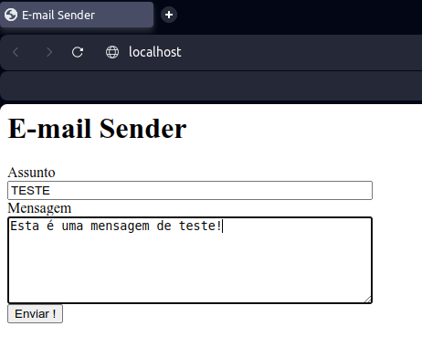
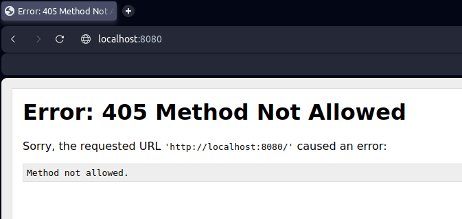
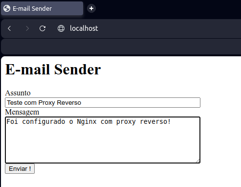
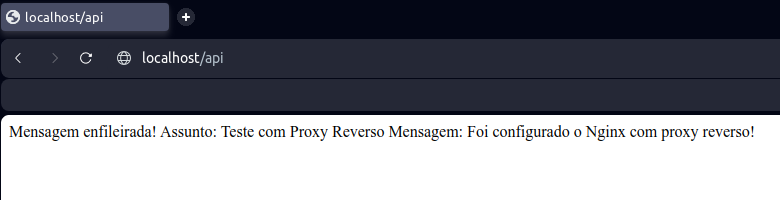

# Entendendo Docker e Docker Compose

[![License][license-badge]][license-url]

> O que um desenvolvedor de software precisa saber sobre Docker e Docker Compose?

Não tenho a intenção de explicar o que é Docker ou Docker Compose, muito menos de demonstrar como essas ferramentas são instaladas. As páginas de documentação das mesmas já o fazem de maneira simples e objetiva, então te convido a visitar os links abaixo e verificar como isto pode ser realizado no seu sistema operacional.

Página de documentação do [Docker](https://docs.docker.com/).

Página de documentação do [Docker Compose](https://docs.docker.com/compose/).

Vou tentar trazer as informações de maneira prática e objetiva, mas aumentando a complexidade das coisas aos poucos, como nós programadores aprendemos: precisamos abstrair a complexidade do problema a ser resolvido, ou seja, vamos dividir um "problemão" em pequenos problemas e resolvê-los por partes.

Mas para isso precisamos primeiro definir qual é o nosso problema e como vamos usar as ferramentas que temos disponíveis para chegar ao nosso objetivo.

Então vamos começar!

Antes de mais nada, não sou especialista em nenhuma das ferramentas que serão utilizadas neste "projeto", esta é uma forma que tenho para aprender mais e entender como as coisas funcionam. Teoria é importante, mas é vazia sem colocar o que você aprendeu em prática. 

E por que fazer tudo isso? 

Já faz um tempo que brinco com Docker, mas a alguns meses atrás fiz um [bootcamp de Engenharia de Dados no IGTI](https://www.xpeducacao.com.br/bootcamp/engenheiro-de-dados), onde foi apresentado o [Apache Airflow](https://airflow.apache.org/) pelo [Prof. Neylson Crepalde](https://www.linkedin.com/in/neylsoncrepalde/), com múltiplos containers, fiquei entusiasmado com aquilo.

Mas nada disso saiu do zero, há algum tempo eu adquiri um [curso de Docker do Prof. Leonardo Leitão da Cod3r](https://www.cod3r.com.br/courses/docker) , acho que você já notou que adoro fazer cursos e aprender coisas novas, e meu entusiasmo com o Airflow me fez agilizar o aprendizado de Docker e Docker Compose.

## Coordenando múltiplos containers

Vamos exemplificar a criação de uma aplicação com múltiplos serviços utilizando o Docker e o Docker Compose para orquestrar os mesmos. Então nosso primeiro passo é definir quais serão esses serviços e qual o objetivo desta aplicação.

Nosso projeto será uma aplicação simples para envio de e-mails com *Workers*, na realidade vamos criar a estrutura e simular esse envio. Para isso precisamos criar os componentes abaixo:

* Banco de Dados
* Servidor Web
* Aplicação principal
* Gerenciador de filas
* Workers para envio de e-mail

Podemos visualizar a estrutura final desses serviços conforme segue.


O Docker Compose usa um arquivo de configuração no padrão [YAML](https://yaml.org), que tem sua especificação neste [link](https://github.com/compose-spec/compose-spec/blob/master/spec.md). Mesmo que nas especificações atualizadas alguns detalhes da criação e conteúdo do arquivo *yaml* sejam diferentes do que as utilizadas neste projeto, por compatibilidade, vamos manter o padrão comumente aceito, ou seja, o nome do arquivo será `docker-compose.yaml`, a extensão *yml* também é aceita, e será informada a versão do mesmo.

> __Importante__
>
> A partir do final de junho de 2023, o Compose V1 não terá mais suporte e será removido de todas as versões do Docker Desktop.
> 
> Certifique-se de mudar para o [Compose V2](https://docs.docker.com/compose/compose-file/) com o plug-in CLI **docker compose** ou ativando a configuração *Use Docker Compose V2* no *Docker Desktop*. Para obter mais informações, consulte a [Evolução do Compose](https://docs.docker.com/compose/compose-v2/).

## Iniciando com o banco de dados

Vamos utilizar o [PostgreSQL 14.8](https://www.postgresql.org) para persistir nosso dados, um detalhe no desenvolvimento de um projeto com vários serviços é utilizar uma versão específica dos componentes, isto vai evitar que sua aplicação "quebre", pois no Docker, quando não é informada a versão, será utilizada a mais recente, com a tag *latest*.

```yaml
version: '3'
services:
  db:
    image: postgres:14.8
    environment:
      POSTGRES_PASSWORD: postgres
```
Aqui temos a estrutura básica do `docker-compose.yaml`, onde declaramos que estamos utilizando a versão 3, definindo as capacidades do Docker Compose, este detalhe tentaremos explorar mais a fundo em outro momento. Note que foi informada uma variável de ambiente para definir uma senha para o usuário *postgres*, isto foi necessário pois as imagens oficiais do PostgreSQL passaram a exigir isto.

Para que a mágica aconteça, só precisamos digitar o comando abaixo, que levanta o serviço em modo *daemon*:

```bash
docker compose up -d
```

Para verificar se o serviço subiu podemos usar ...

```bash
docker compose ps
```

... similar ao *docker ps*, mas restrito apenas aos serviços indicados no `docker-compose.yaml`.

De forma similar, podemos executar um comando interno do PostgreSQL no container:

```bash
docker compose exec db psql -U postgres -c '\l'
```

E finalmente podemos parar o serviço e remover o container, que foi declarado no `docker-compose.yaml` com o comando abaixo:

```bash
docker compose down
```

Agora que já temos o nosso container PostgreSQL sendo executado, precisamos definir um volume para persistir esses dados, pois um container é efêmero, a partir do momento que ele for removido, tudo que estava dentro dele também é removido, ou seja, se foi criado um banco de dados no container, este banco de dados será removido também.
Para que isto não aconteça e os dados sejam perdidos, vamos dizer para nosso container onde esses dados serão armazenados e no nosso caso específico vamos criar um script de inicialização para criar e configurar o banco de dados que será usado na aplicação.

No nosso projeto vamos criar as pastas `postgres_data` e `scripts`, como pode ser observado na imagem abaixo.


Em `scripts`, vamos ter 2 arquivos: *init.sql*, onde vamos criar o banco de dados `email_sender` e definir a tabela `emails`, e no arquivo *check.sql*, vamos listar os bancos de dados, conectar no banco `email_sender` e mostrar como a tabela `emails` está configurada.

__*scripts/init.sql*__
```sql
CREATE DATABASE email_sender;

\c email_sender

CREATE TABLE emails (
  id SERIAL NOT NULL,
  data TIMESTAMP NOT NULL DEFAULT CURRENT_TIMESTAMP,
  assunto VARCHAR(100) NOT NULL,
  mensagem VARCHAR(250) NOT NULL
);
```

__*scripts/check.sql*__
```sql
\l
\c email_sender
\d emails
```

Para que tudo isso funcione, vamos aos ajustes necessários no arquivo `docker-compose.yaml`.

```yaml
version: '3'
volumes:
  dados:
services:
  db:
    image: postgres:14.8
    environment:
      POSTGRES_PASSWORD: postgres
    volumes:
      # volume dos dados
      - ./postgres_data:/var/lib/postgresql/data
      # scripts
      - ./scripts:/scripts
      - ./scripts/init.sql:/docker-entrypoint-initdb.d/init.sql
```

Para maiores informações sobre como utilizar um script de inicialização no container do PostgreSQL, procure a sessão [Initialization scripts](https://hub.docker.com/_/postgres) na página do Docker Hub.

Agora podemos subir o container e verificar se o banco de dados e a tabela configurados acima foram realmente criados.

```bash
docker compose up -d
docker compose exec db psql -U postgres -f /scripts/check.sql
```

## Vamos ao Front-End

Nosso próximo passo é criar um serviço web, para isto vamos utilizar o [Nginx](https://nginx.org), que neste primeiro momento proverá apenas uma página estática simples, sem nenhuma ação por trás. Para isso vamos ajustar o nosso arquivo `docker-compose.yaml` e montar um volume, onde será criado um arquivo *index.html*.

```yaml
version: '3'
volumes:
  dados:
services:
  db:
    image: postgres:14.8
    environment:
      POSTGRES_PASSWORD: postgres
    volumes:
      # volume dos dados
      - ./postgres_data:/var/lib/postgresql/data
      # scripts
      - ./scripts:/scripts
      - ./scripts/init.sql:/docker-entrypoint-initdb.d/init.sql
  frontend:
    image: nginx:1.18
    volumes:
      # página web
      - ./web:/usr/share/nginx/html/
    ports:
      - 80:80
```
__*web/index.html*__
```html
<html>
    <head>
        <meta charset='uft-8'>
        <title>E-mail Sender</title>
        <style>
            label { display: block; }
            textarea, input { width: 400px; }
        </style>
    </head>
    <body class="container">
        <h1>E-mail Sender</h1>
        <form action="">
            <div>
                <label for="assunto">Assunto</label>
                <input type="text" name="assunto">
            </div>

            <div>
                <label for="mensagem">Mensagem</label>
                <textarea name="mensagem" cols="50" rows="6"></textarea>
            </div>

            <div>
                <button>Enviar !</button>
            </div>
        </form>
    </body>
</html>
```

Note que o `form action` ainda está vazio, portanto o formulário que foi criado não fará nada, por enquanto.

Depois de subir os serviços, podemos verificar o log dos mesmos pelo comando abaixo:

```bash
docker compose logs -f -t
```

## Chegamos na aplicação

Já temos nosso banco de dados disponível e um front-end, agora precisamos iniciar o desenvolvimento do aplicativo, onde vamos usar o [Python](https://www.python.org) para enfileirar as mensagens incluídas no front-end.

Para facilitar nosso trabalho será usado um micro web-framework, o [Bottle](https://bottlepy.org), portanto será necessário instalar esta dependência no container do Python que vamos utilizar.

Vamos criar uma nova pasta `app` onde será configurado um volume e na mesma vamos criar o arquivo `app.sh`, onde será instalada nossa dependência através do comando [pip](https://packaging.python.org/tutorials/installing-packages/#installing-from-pypi).

> Encontre, instale e publique pacotes Python com o Python Package Index - [PyPI](https://pypi.org)

__*app/app.sh*__
```bash
#!/bin/sh

# instalando dependência
pip install bottle==0.12.25

# subindo nossa aplicação
python -u sender.py
```

Como podem notar, estamos chamando um programa Python `sender.py`, que também será criado dentro do mesmo volume `app`.

__*app/sender.py*__
```python
# importando pacote
from bottle import route, run, request

# criando uma rota no raiz, que atende requisições POST
@route('/', method='POST')

# método que irá gravar no banco dados, mas por enquanto 
# só vamos retornar uma mensagem formatada do formulário 
# submetido pelo front-end
def send():
    assunto = request.forms.get('assunto')
    mensagem = request.forms.get('mensagem')
    return 'Mensagem enfileirada! Assunto: {} Mensagem: {}'.format(
      assunto, mensagem
    )

# chamando o método na porta 8080
if __name__ == '__main__':
    run(host='0.0.0.0', port=8080, debug=True)
```

Precisamos ajustar o `index.html` para que a requisição do formulário seja realizada para o método Python acima.

__*web/index.html*__
```html
<html>
    <head>
        <meta charset='uft-8'>
        <title>E-mail Sender</title>
        <style>
            label { display: block; }
            textarea, input { width: 400px; }
        </style>
    </head>
    <body class="container">
        <h1>E-mail Sender</h1>
        <form action="http://localhost:8080" method="POST">
            <div>
                <label for="assunto">Assunto</label>
                <input type="text" name="assunto">
            </div>

            <div>
                <label for="mensagem">Mensagem</label>
                <textarea name="mensagem" cols="50" rows="6"></textarea>
            </div>

            <div>
                <button>Enviar !</button>
            </div>
        </form>
    </body>
</html>
```

E finalmente, vamos ajustar nosso `docker-compose.yaml` para disponibilizar esse novo container.

```yaml
version: '3'
volumes:
  dados:
services:
  db:
    image: postgres:14.8
  environment:
      POSTGRES_PASSWORD: postgres
  volumes:
    # volume dados
    - postgres_data:/var/lib/postgresql/data
    # scripts
    - ./scripts:/scripts
    - ./scripts:init.sql:/docker-entrypoint-initdb.d/init.sql
  frontend:
    image: nginx:1.18
    volumes:
      # página web
      - ./web:/usr/share/nginx/html/
    ports:
      - 80:80  
  app:
    image: python:3.10
    volumes:
      # aplicação
      - ./app:/app
    working_dir: /app
    command: ./app.sh
    # porta Bottle
    ports:
      - 8080:8080
```
Vamos verificar se ficou algum serviço executando?

```bash
docker compose ps
```

Se estiver com algum serviço em execução, vamos pará-lo antes de iniciar nossos containers novamente.

```bash
docker compose down
```

Agora sim, podemos levantar nossos serviços...

```bash
docker compose up -d
```
Ao iniciar os serviços do *Docker Compose* você deve receber uma mensagem de erro, provavelmente deste jeito:

```
ERROR: for email-worker_app_1  Cannot start service app: OCI runtime create failed:
container_linux.go:367: starting container process caused: exec: "./app.sh": permission denied: unknown
```
O que acontece é que nosso `script sh` não tem permissão de execução, há várias maneiras de solucionar isso, vou usar aquela que considero mais simples, na linha onde chamamos o *script*, altere como abaixo:

```yaml
app:
    image: python:3.10
    volumes:
      # aplicação
      - ./app:/app
    working_dir: /app
    command: bash ./app.sh
    # porta Bottle
    ports:
      - 8080:8080
```

Depois de implementada a alteração no `docker-compose.yaml`, já sabe, precisamos verificar se ficou algum serviço executando, parar os mesmos e levantar novamente.

Vamos verificar como estão nossos serviços do Docker?

```bash
docker compose logs -f -t
```

Podemos testar nossa aplicação acessando no navegador o link http://localhost



E temos um retorno da mensagem formatada, conforme definimos na nossa aplicação Python.


Como você notou temos 2 serviços respondendo em portas diferentes, desta forma conseguimos acessar nossa aplicação diretamente, pelo link http://locahost:8080. Será apresentado um erro, mas o serviço da aplicação pode ser acessado sem passar pela página web.



Para que isto não ocorra vamos configurar um [Proxy Reverso no Nginx](https://docs.nginx.com/nginx/admin-guide/web-server/reverse-proxy/), desta forma não será mais necessário deixar a porta 8080 exposta.

Aqui vale explicar um detalhe sobre o Docker Compose, quando você cria vários containers no ambiente do *Compose*, um container tem acesso aos outros, desde que eles não sejam segregados em redes separadas. Portanto o container `frontend` consegue acessar o container `app` e é justamente isso que vamos usar para configurar nosso proxy reverso.

A primeira coisa que precisamos fazer é criar o arquivo de configuração do proxy reverso, para isso crie um volume `nginx` como um arquivo de nome `default.conf`, que terá o conteúdo abaixo:

```bash
server {
    listen 80;
    server_name localhost;

    location / {
        root /usr/share/nginx/html;
        index index.html index.htm;
    }

    error_page 500 502 503 504 /50x.html;
    location = /50x.html {
        root /usr/share/nginx/html;
    }

    # proxy reverso
    location /api {
        proxy_pass http://app:8080/;
        proxy_http_version 1.1;
    }
}
```
Vamos precisar ajustar o arquivo `docker-compose.yaml`, incluindo o volume `nginx` no serviço `frontend` e excluindo a porta 8080 do nosso serviço `app`.

```yaml
version: '3'
volumes:
  dados:
services:
  db:
    image: postgres:14.8
    environment:
      POSTGRES_PASSWORD: postgres
  volumes:
    # volume dados
    - postgres_data:/var/lib/postgresql/data
    # scripts
    - ./scripts:/scripts
    - ./scripts:init.sql:/docker-entrypoint-initdb.d/init.sql
  frontend:
    image: nginx:1.18
    volumes:
      # página web
      - ./web:/usr/share/nginx/html/
      # configuração proxy reverso
      - ./nginx/default.conf:/etc/nginx/conf.d/default.conf
    ports:
      - 80:80  
app:
    image: python:3.10
    volumes:
      # aplicação
      - ./app:/app
    working_dir: /app
    command: bash ./app.sh
```

Por último, vamos alterar o atributo *action* do *index.html* conforme abaixo.

```html
<html>
    <head>
        <meta charset='uft-8'>
        <title>E-mail Sender</title>
        <style>
            label { display: block; }
            textarea, input { width: 400px; }
        </style>
    </head>
    <body class="container">
        <h1>E-mail Sender</h1>
        <form action="http://localhost/api" method="POST">
            <div>
                <label for="assunto">Assunto</label>
                <input type="text" name="assunto">
            </div>

            <div>
                <label for="mensagem">Mensagem</label>
                <textarea name="mensagem" cols="50" rows="6"></textarea>
            </div>

            <div>
                <button>Enviar !</button>
            </div>
        </form>
    </body>
</html>
```
Vamos subir nossos serviços e verificar o resultado?



Com o envio dos dados para a aplicação, temos o retorno, mas veja o detalhe do link, *http://localhost/api*.



## Voltando ao início?

Lembra que o primeiro serviço que configuramos e subimos foi o banco de dados? Pois chegou a hora de começar a usá-lo.

Para isso vamos precisar ajustar alguns detalhes da nossa aplicação, precisamos instalar a dependência [Psycopg](https://www.psycopg.org), para que seja possível conectar o Python ao PostgreSQL e persistir esses dados. Vamos começar pelo `app.sh`, onde vamos incluir a instalação deste novo pacote.

```bash
#!/bin/sh

# instalando dependências
pip install bottle==0.12.25 psycopg2==2.9.1

# subindo nossa aplicação
python -u sender.py
```
E para que seja possível realizar a conexão com o PostgreSQL e gravar os dados, vamos ajustar o script `sender.py`.

```python
# importando pacotes
import psycopg2
from bottle import route, run, request

# Data Source Name
# podemos identificar o host pelo IP ou pelo nome do serviço no Compose
DSN = 'dbname=email_sender user=postgres password=postgres host=db'

# query para inserir os dados
SQL = 'INSERT INTO emails (assunto, mensagem) VALUES (%s, %s)'

# método para conectar no PostgreSQL e gravar os dados
def register_message(assunto, mensagem):
    conn = psycopg2.connect(DSN)
    cur = conn.cursor()
    cur.execute(SQL, (assunto, mensagem))
    conn.commit()
    cur.close()
    conn.close()

    print('Mensagem registrada!')  

# criando uma rota no raiz, que atende requisições POST
@route('/', method='POST')

# método que irá chamar o método register_message e
# retornar uma mensagem formatada
def send():
    assunto = request.forms.get('assunto')
    mensagem = request.forms.get('mensagem')

    register_message(assunto, mensagem)
    
    return 'Mensagem enfileirada! Assunto: {} Mensagem: {}'.format(
      assunto, mensagem
    )

# chamando o método na porta 8080
if __name__ == '__main__':
    run(host='0.0.0.0', port=8080, debug=True)
```
Depois dessas alterações podemos subir os serviços e realizar um teste para verificar se os dados estão sendo gravados no PostgreSQL.


Podemos verificar que houve o retorno, conforme desenhado na nossa aplicação...


mas será que os dados foram gravados no banco de dados? Vamos verificar?

```bash
docker compose exec db psql -U postgres -d email_sender -c "SELECT * FROM emails"
```


> Mais uma etapa finalizada!

## Fila e Workers

Vamos criar 2 (dois) novos containers, um que vai ser nossa fila, baseado no [Redis](https://redis.io) e um [worker](https://docs.docker.com/engine/reference/commandline/service_scale), implementado em Python, que vai consumir as mensagens dessa fila para envio de e-mail, no nosso caso será apenas uma simulação de envio.

> Como todos os serviços tem seu próprio container é possível escalar parte dessa estrutura, justamente o que faremos com nosso worker.

Então mãos à obra que temos várias mudanças a serem implementadas, e vamos começar pelo `docker-compose.yaml`.

```yaml
version: '3'
volumes:
  dados:
services:
  db:
    image: postgres:14.8
    environment:
      POSTGRES_PASSWORD: postgres
    volumes:
      # volume dos dados
      - ./postgres_data:/var/lib/postgresql/data
      # scripts
      - ./scripts:/scripts
      - ./scripts/init.sql:/docker-entrypoint-initdb.d/init.sql
  frontend:
    image: nginx:1.18
    volumes:
      # página web
      - ./web:/usr/share/nginx/html/
      # configuração proxy reverso
      - ./nginx/default.conf:/etc/nginx/conf.d/default.conf
    ports:
      - 80:80
  app:
    image: python:3.10
    volumes:
      # Aplicação
      - ./app:/app
    working_dir: /app
    command: bash ./app.sh
  queue:
    image: redis:6.2
  worker:
    image: python:3.10
    volumes:
      # worker
      - ./worker:/worker
    working_dir: /worker
    command: bash ./work.sh
```

Vamos incluir o nosso serviço de fila `queue` e nosso `worker`, neste último vamos utilizar a mesma estratégia do serviço `app`, onde as dependências do Python foram colocadas em um script `sh`.

Antes de implementarmos o nosso `worker` precisamos realizar alguns ajustes no nosso serviço `app`, será incluída a dependência do *Redis*, pois a aplicação além de inserir no banco de dados, vai enviar a mensagem para a fila, que é justamente o *Redis*.

```bash
#!/bin/sh

# instalando dependência
pip install bottle==0.12.25 psycopg2==2.9.1 redis==4.0.2

# subindo nossa aplicação
python -u sender.py
```

... e vamos aproveitar para realizar uma refatoração no `sender.py`

```python
# importando pacotes
import psycopg2
import redis
import json
from bottle import Bottle, request

# classe que vai herdar de Bottle
class Sender(Bottle):
    # criando inicializações
    def __init__(self):
        # super() nos permite sobrescrever métodos e alterar comportamentos
        super().__init__()
        self.route('/',method='POST',callback=self.send)
        # utilizamos o nome do serviço para identificar o host
        self.fila = redis.StrictRedis(host='queue', port=6379, db=0)
        
        # Data Source Name
        # podemos identificar o host pelo IP ou pelo nome do serviço no Compose
        DSN = 'dbname = email_sender user=postgres password=postgres host=db'
        self.conn = psycopg2.connect(DSN)

    # método para conectar no PostgreSQL e gravar os dados
    def register_message(self, assunto, mensagem):
        # query para inserir os dados
        SQL = 'INSERT INTO emails (assunto, mensagem) VALUES (%s, %s)'

        cur = self.conn.cursor()
        cur.execute(SQL, (assunto, mensagem))
        self.conn.commit()
        cur.close()

        # inserir no Redis através do atributo msg  
        msg = {'assunto': assunto, 'mensagem': mensagem}
        # mandando para a fila sender no formato json
        self.fila.rpush('sender', json.dumps(msg))

        print('Mensagem registrada!')  

    # método que irá chamar o método register_message e
    # retornar uma mensagem formatada
    def send(self):
        assunto = request.forms.get('assunto')
        mensagem = request.forms.get('mensagem')

        self.register_message(assunto, mensagem)

        return 'Mensagem enfileirada! Assunto: {} Mensagem: {}'.format(
          assunto, mensagem
        )

# chamando o método na porta 8080
if __name__ == '__main__':
    # criando instancia
    sender = Sender()
    sender.run(host='0.0.0.0', port=8080, debug=True)
```

Vamos criar a pasta `worker` e criar um arquivo `work.sh` onde vamos fazer a instalação das dependências.

__*worker/work.sh*__
```bash
#!/bin/bash

# instalando dependência
pip install redis==4.0.2

# subindo o worker
python -u worker.py
```

__*worker/worker.py*__
```python
import redis
import json
from time import sleep
from random import randint

if __name__ == '__main__':
    r = redis.Redis(host='queue', port=6379, db=0)
    # laço para consumir as mensagens
    while True:
        # vamos pegar a mensagem na fila sender
        mensagem = json.loads(r.blpop('sender')[1])
        # simulando envio de e-mail ...
        print('Mandando a mensagem:',mensagem['assunto'])
        # calculando um randômico inteiro para o Sleep
        sleep(randint(15,35))
        print("Mensagem", mensagem['assunto'], '... enviada com sucesso!')
```

Agora precisamos iniciar nosso serviço e monitorar os _logs_ para verificar o envio das mensagens

```bash
docker compose up -d
docker compose logs -f -t
```

Vamos cadastrar uma mensagem na aplicação e ...


verificar o resultado no log.


## Dependências, redes e escalabilidade

[depends_on](https://docs.docker.com/compose/compose-file/compose-file-v3/#depends_on) cria uma dependência expressa entre serviços, que serve para 2 (duas) coisas: 

* primeiro para orquestrar a inicialização dos serviços, ou seja, o *Docker* vai começar pelos serviços que não dependem de nenhum outro e depois vai buscando pelas dependências configuradas e executando por essa ordem. 
* A outra é que se for inicializado um serviço específico, por exemplo, se inicializar o serviço `frontend` com o comando:

```bash
docker compose up frontend
```
será primeiro verificada a dependência existente neste serviço e inicializada a mesma antes do serviço especificado, vamos entender melhor isso após a configuração do nosso arquivo `docker-compose.yaml`.

Você deve ter notado que quando executamos o comando `docker compose up -d`, além dos serviços que estamos configurando, é inicializado um serviço de rede, ou seja, nossos containers são executados em uma rede própria do Docker, então é uma boa prática segregar esses serviços em suas próprias redes, isto é feito como a criação de uma sessão `networks`.

Então, vamos configurar nosso `docker-compose.yaml` definindo as dependências entre os serviços através do `depends_on` e criar as redes, que podem ser consultadas lá no início deste documento.

```yaml
version: '3'
volumes:
  dados:
networks:
  banco:
  web:
  fila:
services:
  db:
    image: postgres:14.8
    environment:
      POSTGRES_PASSWORD: postgres
    volumes:
      # volume dos dados
      - ./postgres_data:/var/lib/postgresql/data
      # scripts
      - ./scripts:/scripts
      - ./scripts/init.sql:/docker-entrypoint-initdb.d/init.sql
    networks:
      - banco
  frontend:
    image: nginx:1.18
    volumes:
      # página web
      - ./web:/usr/share/nginx/html/
      # configuração proxy reverso
      - ./nginx/default.conf:/etc/nginx/conf.d/default.conf
    ports:
      - 80:80
    networks:
      - web
    depends_on:
      - app
  app:
    image: python:3.10
    volumes:
      # Aplicação
      - ./app:/app
    working_dir: /app
    command: bash ./app.sh
    networks:
      - banco
      - web
      - fila
    depends_on:
      - db
      - queue
  queue:
    image: redis:6.2
    networks:
      - fila
  worker:
    image: python:3.10
    volumes:
      # worker
      - ./worker:/worker
    working_dir: /worker
    command: bash ./work.sh
    networks:
      - fila
    depends_on:
      - queue
```

Note que definimos que o serviço `frontend` depende do serviço `app` e o serviço `app` depende do serviço `db`, esta cadeia de dependência faz com que ao subir especificamente o serviço `frontend`, o Docker Compose inicie o serviço `app` e consequentemente o serviço `db`, para maiores detalhes recomendo verificar a documentação.

Que tal testarmos nossa configuração de rede?

```bash
docker compose up -d
```

Você vai ter um retorno parecido com este...


E agora vamos verificar se as dependências configuradas vão funcionar como esperado?

```bash
docker compose down
docker compose up -d frontend
```
Teremos uma saída como esta:


Da forma que estamos criando nossos serviços, um container separado para cada um, fica muito mais fácil de [escalar](https://docs.docker.com/engine/reference/commandline/service_scale) um desses serviços, gerando várias instâncias para responder a necessidade de aumento de demanda, por exemplo.

Até este momento sempre utilizamos imagens prontas para nossos serviços, mas para que seja possível acompanhar os processos sendo simulados no nosso `worker`, que será o serviço a ser escalado, iremos personalizar uma imagem no nosso projeto.

Para criar essa personalização vamos utilizar um arquivo chamado [**Dockerfile**](https://docs.docker.com/engine/reference/builder), onde definimos como esta imagem será gerada.

```yaml
FROM python:3.10
# quem mantem essa imagem
LABEL maintainer 'Dirlei <dirleiflsilva@dfls.eti.br>'

# setar variável de ambiente para não utilizar o buffer de saída
# com isto podemos visualizar as saídas do worker
ENV PYTHONUNBUFFERED 1

# como este arquivo vai substituir o work.sh
RUN pip install redis==4.0.2

ENTRYPOINT ["/usr/local/bin/python"]
```

Agora precisamos ajustar o nosso `docker-compose.yaml`, definindo a construção da nossa imagem personalizada.

```yaml
version: '3'
volumes:
  dados:
networks:
  banco:
  web:
  fila:
services:
  db:
    image: postgres:14.8
    environment:
      POSTGRES_PASSWORD: postgres
    volumes:
      # volume dos dados
      - ./postgres_data:/var/lib/postgresql/data
      # scripts
      - ./scripts:/scripts
      - ./scripts/init.sql:/docker-entrypoint-initdb.d/init.sql
    networks:
      - banco
  frontend:
    image: nginx:1.18
    volumes:
      # página web
      - ./web:/usr/share/nginx/html/
      # configuração proxy reverso
      - ./nginx/default.conf:/etc/nginx/conf.d/default.conf
    ports:
      - 80:80
    networks:
      - web
    depends_on:
      - app
  app:
    image: python:3.10
    volumes:
      # Aplicação
      - ./app:/app
    working_dir: /app
    command: bash ./app.sh
    networks:
      - banco
      - web
      - fila
    depends_on:
      - db
      - queue
  queue:
    image: redis:6.2
    networks:
      - fila
  worker:
    # substituindo
    # image: python:3.10
    build: worker
    # neste caso estamos informando que o arquivo 
    # Dockerfile será procurado no diretório worker
    volumes:
      # worker
      - ./worker:/worker
    working_dir: /worker
    # este comando será executado considerando o ENTRYPOINT informado no Dockerfile
    # esta chamada era realizada no work.sh
    command: worker.py
    networks:
      - fila
    depends_on:
      - queue
```

Para que possamos visualizar as mensagens processadas, vamos ajustar o `worker.py`

__*worker/worker.py*__
```python
import redis
import json
from time import sleep
from random import randint

if __name__ == '__main__':
    r = redis.Redis(host='queue', port=6379, db=0)

    # apenas para que possamos visualizar a chamada ao serviço
    print('Aguardando mensagens...')

    # laço para consumir as mensagens
    while True:
        # vamos pegar a mensagem na fila sender
        mensagem = json.loads(r.blpop('sender')[1])
        # simulando envio de e-mail ...
        print('Mandando a mensagem:',mensagem['assunto'])
        # calculando um randômico inteiro para o Sleep
        sleep(randint(15,35))
        print("Mensagem", mensagem['assunto'], '... enviada com sucesso!')
```

Para verificar se tudo está funcionando vamos executar o Docker Compose e informar qual o serviço será escalado e quantas instâncias serão criadas.

```bash
docker compose up -d --scale worker=3
```
Teremos algo parecido com o que está abaixo.


Enviando mensagens...


Vamos mostrar os logs dos serviços do `worker`

```bash
docker compose logs -f -t worker
```


Ufa!!! Conseguimos finalizar nosso projeto, demonstrando na prática como utilizar o **Docker** não só como ferramenta, mas também entender os conceitos por trás disso tudo. Porém tem mais um ou dois detalhes que quero apresentar para complementar nosso aprendizado.

## Configuração e armazenamento de variáveis de ambiente

Por mais que esse seja um projeto em que o foco foi aprender a usar uma ferramenta, foram criados pequenos trechos de código, onde dados que são considerados sensíveis, como senhas, estão expostos e que devemos seguir boas práticas para minimizar o impacto dessa exposição, como a iniciativa [*The Twelve-Factor App*](https://12factor.net).

Para isso vamos ajustar nosso código, passando a usar a biblioteca [*os*](https://docs.python.org/3.10/library/os.html) do Python. Também sugiro dar uma verificado no pacote [python-dotenv](https://pypi.org/project/python-dotenv/).

```python
# importando pacotes
import psycopg2
import redis
import json
import os # lib para ler variáveis de ambiente
from bottle import Bottle, request

# classe que vai herdar de Bottle
class Sender(Bottle):
    # criando inicializações
    def __init__(self):
        # super() nos permite sobrescrever métodos e alterar comportamentos
        super().__init__()
        self.route('/',method='POST',callback=self.send)
        
        # uso da variável de ambiente REDIS_HOST
        # se não for localizada a variável ou seu conteúdo
        # será utilizado um padrão, no caso <queue>
        redis_host = os.getenv('REDIS_HOST','queue')
        self.fila = redis.StrictRedis(host=redis_host, port=6379, db=0)
        
        # Diversas variáveis de ambiente (incluindo o DB_NAME)
        db_host = os.getenv('DB_HOST', 'db')
        db_user = os.getenv('DB_USER', 'postgres')
        db_psw = os.getenv('DB_PSW', 'postgres')
        db_name = os.getenv('DB_NAME', 'sender') 
        
        # note que db_name está diferente do usado até agora
        # mas em seguida vamos mostrar que esta variável será
        # exposta no <docker-compose.yaml>
 
        # Uso das variáveis de ambiente para conexão com o banco de dados
        dsn = f'dbname={db_name} user={db_user} password={db_psw} host={db_host}'
        self.conn = psycopg2.connect(dsn)

    # método para conectar no PostgreSQL e gravar os dados
    def register_message(self, assunto, mensagem):
        # query para inserir os dados
        SQL = 'INSERT INTO emails (assunto, mensagem) VALUES (%s, %s)'

        cur = self.conn.cursor()
        cur.execute(SQL, (assunto, mensagem))
        self.conn.commit()
        cur.close()

        # inserir no Redis através do atributo msg  
        msg = {'assunto': assunto, 'mensagem': mensagem}
        # mandando para a fila sender no formato json
        self.fila.rpush('sender', json.dumps(msg))

        print('Mensagem registrada!')  

    # método que irá chamar o método register_message e
    # retornar uma mensagem formatada
    def send(self):
        assunto = request.forms.get('assunto')
        mensagem = request.forms.get('mensagem')

        self.register_message(assunto, mensagem)

        return 'Mensagem enfileirada! Assunto: {} Mensagem: {}'.format(
          assunto, mensagem
        )

# chamando o método na porta 8080
if __name__ == '__main__':
    # criando instancia
    sender = Sender()
    sender.run(host='0.0.0.0', port=8080, debug=True)
```

Podemos realizar esses ajustes no `worker.py` também.

__*worker/worker.py*__
```python
import redis
import json
import os # lib para ler variáveis de ambiente
from time import sleep
from random import randint

if __name__ == '__main__':
    # uso da variável de ambiente REDIS_HOST
    redis_host = os.getenv('REDIS_HOST','queue')
    r = redis.Redis(host=redis_host, port=6379, db=0)
    
    print('Aguardando mensagens...')
    
    # laço para consumir as mensagens
    while True:
        # vamos pegar a mensagem na fila sender
        mensagem = json.loads(r.blpop('sender')[1])
        # simulando envio de e-mail ...
        print('Mandando a mensagem:',mensagem['assunto'])
        # calculando um randômico inteiro para o Sleep
        sleep(randint(15,35))
        print("Mensagem", mensagem['assunto'], '... enviada com sucesso!')
```

E vamos incluir a [variável de ambiente](https://docs.docker.com/compose/environment-variables/) da identificação do banco de dados usado, no serviço `app`.

```yaml
version: '3'
volumes:
  dados:
networks:
  banco:
  web:
  fila:
services:
  db:
    image: postgres:14.8
    environment:
      POSTGRES_PASSWORD: postgres
    volumes:
      # volume dos dados
      - ./postgres_data:/var/lib/postgresql/data
      # scripts
      - ./scripts:/scripts
      - ./scripts/init.sql:/docker-entrypoint-initdb.d/init.sql
    networks:
      - banco
  frontend:
    image: nginx:1.18
    volumes:
      # página web
      - ./web:/usr/share/nginx/html/
      # configuração proxy reverso
      - ./nginx/default.conf:/etc/nginx/conf.d/default.conf
    ports:
      - 80:80
    networks:
      - web
    depends_on:
      - app
  app:
    image: python:3.10
    volumes:
      # Aplicação
      - ./app:/app
    working_dir: /app
    command: bash ./app.sh
    networks:
      - banco
      - web
      - fila
    depends_on:
      - db
      - queue
    # criando variável ambiente
    environment:
      - DB_NAME=email_sender
  queue:
    image: redis:6.2
    networks:
      - fila
  worker:
    # substituindo
    # image: python:3.10
    build: worker
    # neste caso estamos informando que o arquivo 
    # Dockerfile será procurado no diretório worker
    volumes:
      # worker
      - ./worker:/worker
    working_dir: /worker
    # este comando será executado considerando o ENTRYPOINT informado no Dockerfile
    # esta chamada era realizada no work.sh
    command: worker.py
    networks:
      - fila
    depends_on:
      - queue
```

Vamos ao nosso *detalhe 2*, no *Docker* existe como expor uma variável de ambiente de uma forma mais simples e prática, usando [**override**](https://docs.docker.com/compose/extends/).

Resumindo, por padrão, o **Compose** lê dois arquivos, um `docker-compose.yaml` e um arquivo opcional, `docker-compose.override.yaml`. Por convenção, o primneiro contém sua configuração base. O arquivo de substituição (*override*), como o próprio nome indica, pode conter substituições de configuração para serviços existentes ou serviços totalmente novos.

Vamos ver isso na prática? Retire o atribuição da variável de ambiente do `docker-compose.yaml`, que foi realizada logo acima e crie o arquivo `docker-compose.override.yaml` abaixo.

```yaml
version: '3'
services:
  app:
    environment:
      - DB_NAME=email_sender
```

Vamos a um último teste?


Executando um *SELECT* no banco de dados, encontramos os dados gravados corretamente. \o/


#### License
[MIT](https://github.com/dirleif/entendendo-docker-e-docker-compose/blob/main/LICENSE)

#### Fontes:
<https://docs.docker.com>

<https://docs.docker.com/compose>

<https://github.com/compose-spec/compose-spec/blob/master/spec.md>

<https://yaml.org>

<https://hub.docker.com/_/postgres>

<https://hub.docker.com/_/nginx>

<https://hub.docker.com/_/python>

<https://bottlepy.org>

<https://packaging.python.org/tutorials/installing-packages/#installing-from-pypi>

<https://docs.nginx.com/nginx/admin-guide/web-server/reverse-proxy>

<https://redis.io>

<https://docs.python.org/3/library/functions.html#super>

<https://docs.docker.com/compose/compose-file/compose-file-v3/#depends_on>

<https://docs.docker.com/compose/compose-file/compose-file-v3/#networks>

<https://docs.docker.com/engine/reference/commandline/service_scale/>

<https://docs.docker.com/engine/reference/builder/>

<https://12factor.net/>

<https://docs.python.org/3.10/library/os.html>

<https://pypi.org/project/python-dotenv/>

<https://docs.docker.com/compose/environment-variables/>

<https://docs.docker.com/compose/extends/>

[license-badge]: https://img.shields.io/github/license/dirleif/entendendo-docker-e-docker-compose
[license-url]: https://opensource.org/licenses/MIT